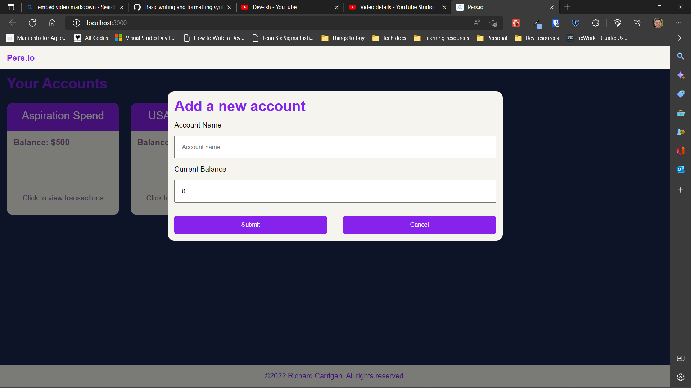

# Pers

## Overview

Pers is designed to be the easiest financial app you'll ever use. Instead of requiring you to create a budget, allocate arbitrary amounts to each category, and then track your progress, Pers lets you plug in all of your forecasted trnasactions and see how much money you'll have on any given date.

I decided to name it Pers because I realized that most other financial apps are predominantly male-focused, as they refer to the financial apparatus as a 'wallet'. A side-quest I have for Pers is that it will feature a purse-shaped logo and gender-neutral language so that everyone feels welcome.

Obviously it's not there yet, but it will be. For now, you can:

1. Create new accounts
2. Create new transactions corresponding to an account
3. Edit the name of each account
4. Edit all details of a transaction
5. Drag-and-drop transactions to reorder them (works with keyboard too!)
6. Delete transactions
7. Delete accounts (also deletes corresponding transactions)

Here's a demo of the state as of September 2022:

[](https://youtu.be/wGN4P0hY6vs)

## Next Steps

You can track planned features by looking at the issues related to this project, but a high level, the planned features include:

- Running balance for each account, based on current balance set and all forecasted transactions added
- Adding drag-and-drop functionality for account cards
- Improving UI design to be more responsive and fix any accessibility issues
- Add dark/light mode toggle (may also include 'System Default' option)
- Add passwordless user authentication so each user can have own set of accounts and transactions
- Allow users to integrate with financial institutions to allow some awesome use cases such as:
  - AI model that will learn to recognize mapped transactions so that a forecasted transaction may automatically be removed once it has shown up in the account statement
  - Automatically updated balances

## Contributing

If you'd like to take Pers for a test-drive, or if you'd like to help propel this project forward, follow the steps below to get started:

1. Clone repo using the built-in GitHub UI options, or by running

```
git clone https://github.com/nihonjinboy85/pers.git
```

2. Once cloned, navigate to the "server" directory using a command like

```
cd server
```

3. Within the "server" directory, start the Node/GraphQL server in dev mode with

```
npm run dev
```

4. Next, in a separate CLI window, move to the "client" directory

```
cd client
```

5. Within the "client" directory, start the React/GraphQL client

```
npm start
```

6. You should now have a browser window automatically opened to localhost:3000, but if not, simply open your favorite browser and navigate to localhost:3000
7. Optionally, you can access the GraphQL server UI directly by going to localhost:4000
